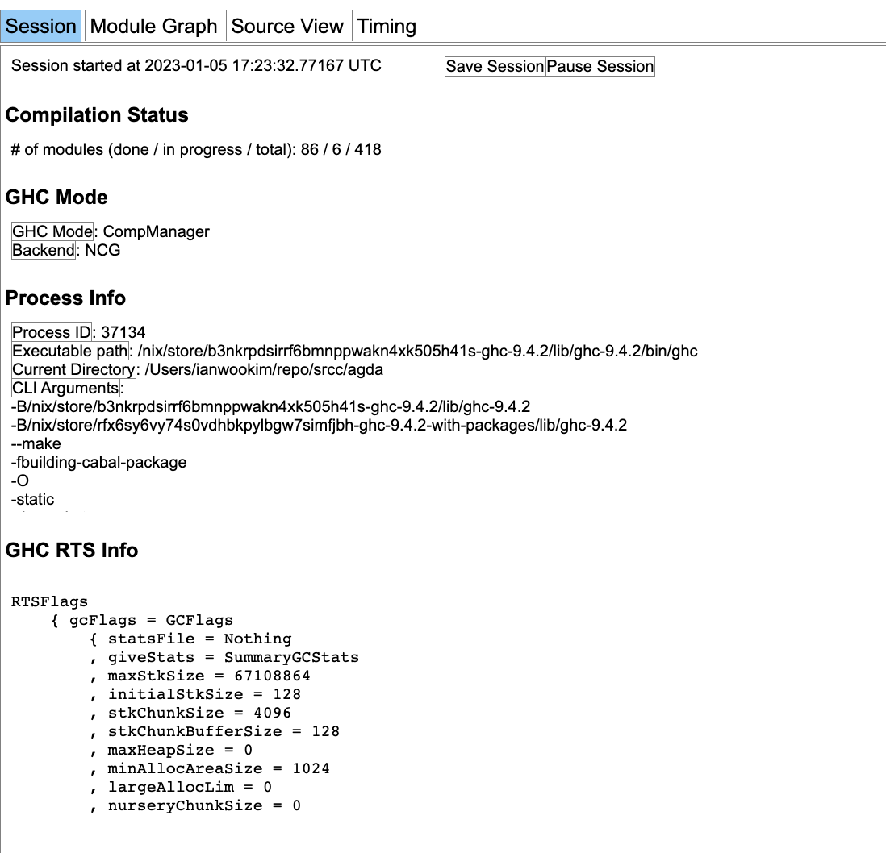
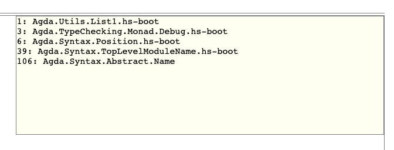
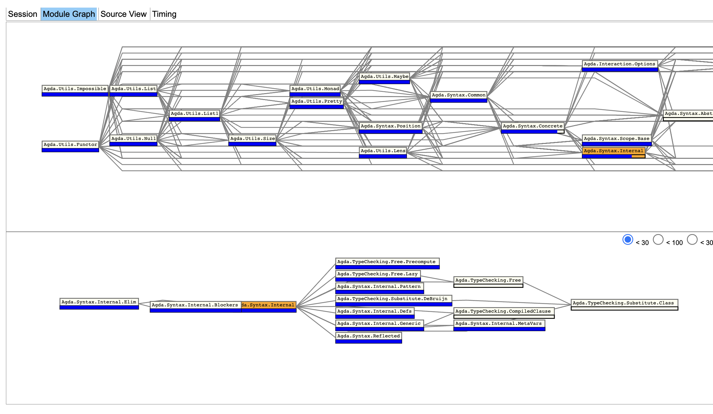
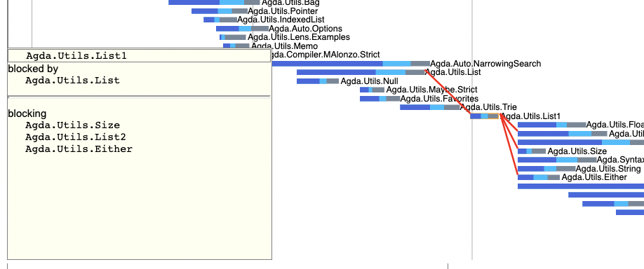
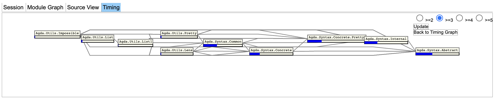
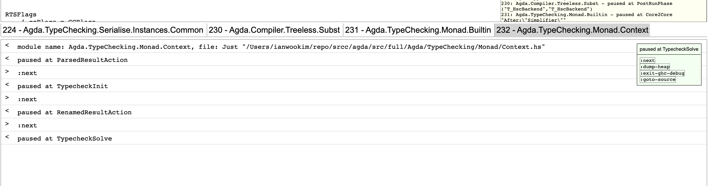
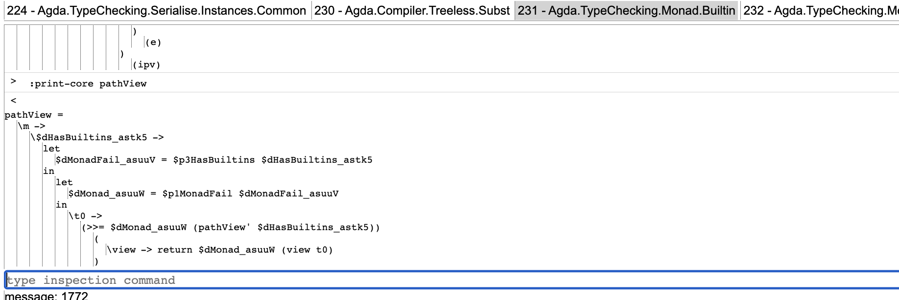

Features
========

GHC Status
----------

- GHC Process information

- Current modules in compilation

Build Information and Performance
---------------------------------

- Build Graph

- Build Timing and Memory

.. image:: images/screenshots/build-timing-memory.png
   :width: 480

- Blocker module information

Interactive inspection
----------------------

- Pause/Resume/Breakpoint/Console

- Source View

Features under development
--------------------------

- ghc-debug integration
- ghci integration
