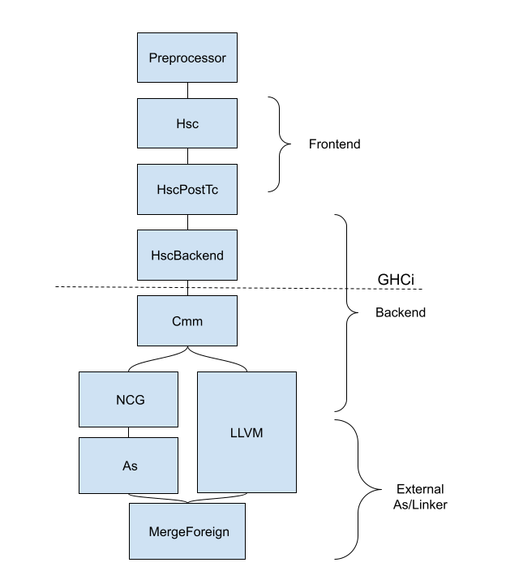
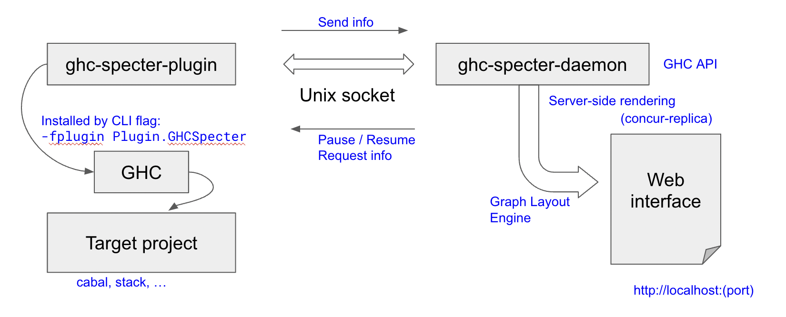

How ``ghc-specter`` works
=========================

As a plugin system that installs multiple plugins and hooks dynamically,
``ghc-specter`` is very closely tied to the GHC internal implementation.
In this section, we will briefly overview the GHC compiler system and
exhibit how the ``ghc-specter-plugin`` works inside GHC and also show how
the ``ghc-specter-plugin`` and ``ghc-specter-daemon`` interplay.

Background on the GHC Pipeline
------------------------------

GHC operates in multiple different modes and each invocation of the GHC process consists of
a sequence of operations called phases in the pipeline. Roughly speaking, what each
phase/sub-phase does is to transform an intermediate representation of a given program to
another lower-level intermediate representation until it is finally transformed to an assembly
or similar (for example, LLVM-IR) so that it can be consumed by external standard tools to create
an executable binary object. The process varies in different modes undoubtedly.

The compilation also depends on the configuration environment many of which are set up via
CLI flags. Over the course, the pipeline enriches (and simplifies if unnecessary) its internal
state which consists of unique identifiers, names and type checking information.
All of this persistent or transient information are of the interest of ``ghc-specter`` and we
will try to capture and dump the information as requested. To hijack the pipeline, we rely on
the GHC pipeline via the GHC plugin mechanism to install such inspection procedures.

In the following, we expand the above description in detail.
Note that The information here is presented for the sake of overview and
mainly based on the GHC 9.4 implementation, and is neither
precise nor comprehensive. In addition, for GHC 9.2, there are significant
differences -- in particular, the GHC phases, --  so one should refer to the
GHC documentation and the source code for more accurate information.

GHC Mode
^^^^^^^^

When invoked from the Command-Line-Interface (CLI), GHC is run in a certain mode.
As we all are familiar, GHC can be used as both compiler and interpreter.
In fact, this is one of the special luxurious features of GHC that we Haskell
developers all enjoy. GHC compiler seamlessly integrates the interpreter
read-eval-print-loop (REPL) session. GHC interpreter and the Run-Time-System (RTS)
allows one to mix interpreted codes with other precompiled native binary
bytecode.

The compiler mode (or batch mode) can be run (i) in compilation manager mode
(``--make``) in which a single GHC session will make a build plan (by topolically
ordering module graph) and compile a group of modules associated with their source
codes, or (ii) in oneshot mode (``-c``) in which only a single module is built for
that GHC process. As the compilation starts, per module, a single GHC pipeline
is carried out in a sequence of phases as explained in the next subsection.

The interpreter mode compiles source codes or load precompiled modules dynamically
from the user demand in a REPL session. Therefore, the interpreter mode is a
trampoline process between a REPL session and compilation pipeline. When compiling
a source file as demanded, the same GHC pipeline is invoked, so the plugins
associated to each phase will be invoked as the compiler mode. But the backend
phases for generating Cmm and assembly codes and linking is not performed since
it is unnecessary.

Phases and internal representation
^^^^^^^^^^^^^^^^^^^^^^^^^^^^^^^^^^

A single module is being compiled in a single pipeline thread. In large chunks,
the pipeline consists of the frontend phases, the backend phases and the external
assembler/linker phases. The frontend phases starts with source codes, and
parsing, typechecking, desugaring, andresults in GHC Core. The GHC Core is
optimized in a few Core-to-Core passes. Then, the backend phases generate
the STG and Cmm representation, and finally generates assembly codes or LLVM IR
depending on the configuration. Afterwards, the external assembler and linker
(such as gcc or clang toolchain) will create a linkable binary.

The frontend phase may start with a preprocessor (such as ``hsc2hs``). The
compilation may end before the external linking process. For example, for the
GHC interpreter mode, the compilation ends with producing bytecode binary and then
the interpreter RTS will load and execute the bytecode directly.

We list the relevant phases as defined in the GHC API 9.4 in the following:

  - ``Cpp``, ``HsPp``: C and Haskell preprocessor
  - ``Hsc``: Haskell frontend compiler up to type-checker
  - ``HscPostTc``: Haskell frontend compiler after type-checker
  - ``HscBackend``: Core backend compiler
  - ``Cmm``: C-- compiler
  - ``As``: External assembler
  - ``LlvmOpt``, ``LlvmLlc``, ``LlvmMangle``: LLVM
  - ``MergeForeign``: linker for foreign source

In each phase, there can be smaller steps, which is called a `pass` in the GHC
terminology.

In the above, we briefly mentioned that each compilation phase produces a certain
intermediate representation of the Haskell program. In a sense, the compiler is
a sequence of transformation steps of such representations:

  - Source code and preprocessed code stored in file text file
  - ``HsParsedModule`` containing High-level Haskell declaration AST ``HsDecl``
    (containing ``HsBind`` and ``HsExpr``) annotated with
    ``Hsc``-phase-specific ``pass``-dependent information.
    Here, ``pass`` is progressed from ``Parsed`` through ``Renamed`` to ``Typechecked``.
  - GHC-Core-level ``CoreProgram`` which consists of a list of ``CoreBind`` (containing ``CoreExpr``)
  - STG-level ``StgTopBinding`` (``StgBinidng`` and ``StgExpr``)
  - Cmm-level ``CmmDecl``
  - Generated assembly or LLVM bitcode in generated files

Environment and state
^^^^^^^^^^^^^^^^^^^^^

Various configurations are determined before kicking off the compilation process. The CLI parameters
are parsed and adjusted (by default or determined by system environment) with a few dynamically linked
objects -- GHC plugins are such objects. The resultant configuration is stored in ``DynFlags`` data type,
so making the content of ``DynFlags`` available to users is very useful.

GHC is invoked in the ``CompManager`` mode, then the module dependency graph is analyzed and topologically
sorted. Then, each module compilation is swept over the ordered list with the global shared environment
``HscEnv``. The module graph information is stored in ``ModGraph``.

Right after parsing the source code, the names in the parsed module are extracted but not yet bound to known
imported/declared names, and conflicting names are not resolved with unique IDs. Therefore, the compiler
does the ``Renamed`` pass. The information extracted and resolved should be accumulated into a global map,
``GlobalRdrEnv``. After the name resolution and issuing unique IDs, typechecker pass will follow and develop
another global map as a part of compilation state, collecting typechecking evidences.
Combining such maps with the fully resolved Haskell AST, the accumulated ``TcGblEnv`` is produced as the
result of the frontend typechecker and passed to the ``HscPostTc`` phase.

Plugins and Hooks
^^^^^^^^^^^^^^^^^

  - GHC plugin, by which one can insert a custom code at a predefined plugin location in the compilation
  - GHC hooks, with which, one can replace a particular segment of compilation by a custom code.

``ghc-specter`` System Design
-----------------------------

The left figure shows the configuration of `ghc-specter` application. The GHC plugin
`ghc-specter-plugin` is instantiated by invoking GHC with the CLI argument
`-fplugin Plugin.GHCSpecter`.  The daemon process `ghc-specter-daemon` should
be running as a separate process before the plugin instantiation.
As designated by a configuration file (``ghc-specter.yaml`` by default), the
communication channel through a Unix socket between GHC and the daemon is
established.

We use ``driverPlugin`` as the starting point, and the plugin will install plugins and hooks dynamically.
As plugins, ``parsedResultActionPlugin``, ``typecheckPlugin``, ``corePlugin`` that installs CoreToDo actions
interleaved with existing CoreToDo steps.
We use ``runPhaseHook``, ``runMetaHook``, ``stgToCmmHook`` and ``cmmToRawCmmHook``.

The daemon is a web server to present the contents from `ghc-specter-plugin`.
